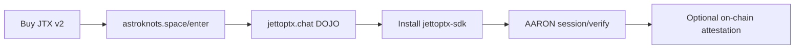

Before integrating with OPTX APIs, most developers need **platform access** — holding ≥1 **$JTX v2** on Solana mainnet unlocks [jettoptx.chat](https://jettoptx.chat) (DOJO).

Source: [jettoptx-saas](https://github.com/jettoptx/jettoptx-saas) (astroknots.space marketing + access gate)

## Access Paths

| Path | How | Result |
|------|-----|--------|
| **Buy JTX** | Jupiter / Meteora on [astroknots.space/stake](https://astroknots.space/stake) or [jtx.astroknots.space](https://jtx.astroknots.space) | Hold ≥1 JTX v2 |
| **Enter DOJO** | Connect wallet at [astroknots.space/enter](https://astroknots.space/enter) | Redirect to jettoptx.chat |
| **Subscribe** | Stripe $8.88/mo via JETT Hub | Wallet-less DOJO access — see [Subscriptions](/docs/token/subscriptions) |
| **Stake tiers** | MOJO / DOJO / SPACE COWBOY | See [Tiers](/docs/token/tiers) |

## Canonical JTX v2 Mint

```
JTXGnx83s2QZ2MwYkRD1cBKrqQKSdG5oe8vSYW5Zjoe
```

Token-2022, 9 decimals, mainnet. Legacy v1 (`9XpJiKEY…`) has revoked mint authority — see [Trading & Mint](/docs/token/trading) for migration.

## Developer Flow



1. Acquire JTX v2 on mainnet
2. Pass the `/enter` balance gate (≥1 JTX)
3. Use DOJO at jettoptx.chat for JOE API tokens (DOJO tier)
4. Install [SDK packages](/docs/sdk) for custom integrations
5. Call [AARON](/docs/protocol/client-integration) for gaze attestation

## Waitlist API

astroknots.space exposes a public waitlist endpoint:

```
POST /api/waitlist
POST /api/jtx-check  — lightweight JTX balance verifier
```

## Related

- [Token Overview](/docs/token) — governance and DePIN economics
- [JETT Auth](/docs/authentication/jett-auth) — auth after access
- [Edge Gateway](/docs/infrastructure/edge-gateway) — gated MCP for DOJO subscribers
